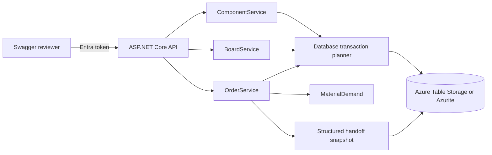

# SMT Order Management

An ASP.NET Core 8 API for Components, versioned Board recipes, stock reservations, Orders, and a production planning handoff. Swagger UI at `/swagger` is the reviewer interface. Azure Table Storage is the only persistent store; local development uses Azurite.

## Design



`Program` owns Entra authentication and HTTP routes. `ComponentService` owns Component stock and identity; `BoardService` owns Board revisions. `OrderService` owns reservations and the production transition. `MaterialDemand` calculates demand without I/O. `Database` stores entities in one Table partition and commits changes as entity group transactions. Each mutation conditionally replaces one version entity using its ETag. If another API instance writes first, the request re-reads and recalculates before retrying. This protects stock and references across instances.

Components, Boards, revisions, Orders, unique part number indexes, and production snapshots occupy separate RowKey prefixes. IDs and Board revision numbers encoded in a row's RowKey are reconstructed on read instead of being repeated in that row's `Json` property. Recipe Component IDs and Order-line Board IDs and revisions remain in JSON because they reference other records. New production snapshot headers use the same `Json` property; older headers with separate Table properties remain readable. Board and Component snapshot rows retain their structured properties. A Table Storage entity group transaction allows at most 100 entity operations in one partition. Order creation and edit check the eventual production batch size, and Board revisions are capped at 97 so deletion remains possible. Larger changes receive `batch_limit` or `revision_limit` before they leave unusable records. The shared partition and catalog scans suit this small reviewer demo; they limit throughput and dataset size.

Physical stock counts whole pieces. Available stock is physical stock minus reservations. Board edits append revisions and existing Orders retain their selected revision. An Order may include several revisions of one Board, but each Board and revision pair appears only once. Order create and edit aggregate `build quantity × recipe quantity` and reserve that demand atomically with stock changes. A Reserved Order can be edited or deleted. Its first download marks it Started, consumes physical stock, releases reservations, and saves the snapshot in one transaction. Later downloads read that snapshot, yielding the same JSON bytes. Started Orders cannot be edited or deleted.

## Entra registration

1. Create a single tenant API app registration. Expose an Application ID URI such as `api://<api-client-id>` and the delegated scope `access_as_user`. Set `Entra__Audience` to the API token's `aud` value, `Entra__AppIdUri` to the URI, and `Entra__TenantId` to the tenant GUID.
2. Create a separate single tenant SPA registration. Add Swagger redirect URIs `http://localhost:8080/swagger/oauth2-redirect.html` and `https://<app-name>.azurewebsites.net/swagger/oauth2-redirect.html`. Give it delegated permission for the API scope and grant consent as your tenant requires. Set `Entra__BrowserClientId` to its client ID. Swagger uses authorization code with PKCE.
3. Use dedicated demo accounts for reviewers and share credentials privately. Authenticated users with the delegated scope have equal application permissions.

For another localhost port, register its redirect URI. See [Microsoft's JWT bearer guidance](https://learn.microsoft.com/en-us/aspnet/core/security/authentication/configure-jwt-bearer-authentication).

## Run locally with Azurite

Requirements: Docker Compose and a Microsoft Entra tenant for reviewer sign in. Copy `.env.example` to `.env` and replace the placeholders. `.env` is Git ignored.

```sh
docker compose up --build -d
```

Compose runs the Azurite Table service on port 10002 and the API on port 8080. Open `http://localhost:8080/swagger`. `/health` is public; `/api` requires a delegated `access_as_user` token. The API creates its Table and version entity on startup. A fresh installation has no Components, Boards, or Orders.

Local application events stay on the console; view them with `docker compose logs -f api`.

To clear a disposable local Table and start again with no application records, run:

```sh
docker compose run --rm api --clear-data
```

This deletes all records, including started Orders and snapshots, then recreates only the version record. Run it only against a disposable Table.

For tests outside Compose, start Azurite locally (`npx azurite-table --location ./azurite-data`) and run:

```sh
dotnet restore SmtOrders.sln
dotnet build SmtOrders.sln --no-restore
dotnet test SmtOrders.sln --no-build
```

The tests use `UseDevelopmentStorage=true` by default. Set `SMT_TEST_TABLES` to another Azurite connection string if needed. Each integration test creates and deletes its own uniquely named Table. CI runs the same suite against an Azurite service.

## Run on Azure

### Current deployment

The shared reviewer API is deployed in West Europe at [smt-orders-e103ef-api.azurewebsites.net/swagger](https://smt-orders-e103ef-api.azurewebsites.net/swagger). Its resource group is `rg-smt-orders-demo` in subscription `85ed71b1-83f9-4a91-bf61-78fd20259323`. It uses Azure Table Storage and a managed identity. The Table starts empty of application records; reviewers create their own Components, Boards, and Orders through Swagger. Sign in using a tenant account allowed to consent to the delegated `access_as_user` scope. The public `/health` endpoint returns `200`; an anonymous `/api/components` request returns `401`.

Verified on 2026-09-25 before clearing the Table: Entra sign-in, Component create/read/delete, Reserved Order creation, first production download, and an identical second download. The test Board consumed three resistors on the first download: physical stock changed from 1,000 to 997 and remained there on retry. All test records were subsequently cleared.

GitHub Actions [builds, tests, and deploys](https://github.com/Zergie/Coding-Challenge/actions/workflows/ci.yml) passing `main` commits. Deployment uses an Entra application with a federated credential for this repository's immutable GitHub identity and the `main` branch. It has Website Contributor access scoped to this Web App. Repository secrets hold the deployment client, tenant, and subscription IDs; no long lived credential is stored. The Swagger SPA's delegated permission is subject to the tenant's consent policy.

### Set up a new deployment with Azure CLI

These commands create a Windows App Service F1 plan, a Standard LRS StorageV2 account, and a Web App in West Europe (`westeurope`). The Web App uses its system assigned identity to access Table Storage. The API creates the `SmtOrders` Table and version record on first start, leaving Components, Boards, and Orders empty. No storage key or demo seed is needed. The [retail estimate](docs/azure-cost-estimate.md) is about **$0.05/month** for 1 GB and 100,000 operations; check actual subscription pricing before provisioning.

First complete the [Entra registration](#entra-registration), including the new Web App's Swagger redirect URI. From the repository root in PowerShell, replace the placeholder values below. The Storage account name must be globally unique and contain only lowercase letters and digits; the Web App name must also be globally unique. Sign in with an account that can create resources and assign the Storage Table Data Contributor role.

```powershell
$tenantId = 'YOUR_ENTRA_TENANT_ID'
$subscriptionId = 'YOUR_SUBSCRIPTION_ID'
$resourceGroup = 'YOUR_RESOURCE_GROUP'
$plan = 'YOUR_APP_SERVICE_PLAN_NAME'
$storageAccount = 'YOUR_UNIQUE_LOWERCASE_STORAGE_NAME'
$webApp = 'YOUR_UNIQUE_WEB_APP_NAME'
$apiAudience = 'YOUR_API_TOKEN_AUDIENCE'
$appIdUri = 'api://YOUR_API_CLIENT_ID'
$browserClientId = 'YOUR_BROWSER_CLIENT_ID'

az login --tenant $tenantId
az account set --subscription $subscriptionId
az group create --name $resourceGroup --location westeurope
az appservice plan create --name $plan --resource-group $resourceGroup --location westeurope --sku F1 --is-linux false
az storage account create --name $storageAccount --resource-group $resourceGroup --location westeurope --kind StorageV2 --sku Standard_LRS --allow-blob-public-access false --allow-shared-key-access false --min-tls-version TLS1_2
az webapp create --name $webApp --resource-group $resourceGroup --plan $plan --runtime 'DOTNETCORE:8.0'
az webapp update --name $webApp --resource-group $resourceGroup --https-only true
az webapp config set --name $webApp --resource-group $resourceGroup --use-32bit-worker-process true --ftps-state Disabled --min-tls-version 1.2

$principalId = az webapp identity assign --name $webApp --resource-group $resourceGroup --query principalId --output tsv
$storageId = az storage account show --name $storageAccount --resource-group $resourceGroup --query id --output tsv
az role assignment create --assignee-object-id $principalId --assignee-principal-type ServicePrincipal --role 'Storage Table Data Contributor' --scope $storageId

az webapp config appsettings set --name $webApp --resource-group $resourceGroup --settings "Storage__TableServiceUri=https://$($storageAccount).table.core.windows.net" 'Storage__TableName=SmtOrders' "Entra__TenantId=$tenantId" "Entra__Audience=$apiAudience" "Entra__AppIdUri=$appIdUri" "Entra__BrowserClientId=$browserClientId" 'Production__Destination=SMT-LINE-1'

dotnet publish src/SmtOrders.Api/SmtOrders.Api.csproj --configuration Release --output .scratch/publish
Compress-Archive -Path .scratch/publish/* -DestinationPath .scratch/api.zip -Force
az webapp deploy --name $webApp --resource-group $resourceGroup --src-path .scratch/api.zip --type zip
az webapp log config --name $webApp --resource-group $resourceGroup --application-logging filesystem --level information
```

Allow time for role assignment propagation before the app first accesses Table Storage. Open `https://<web-app-name>.azurewebsites.net/swagger`; verify `/health`, anonymous `401` from `/api/components`, Entra sign in, and the create-to-download path. The Table starts with no application records. The GitHub workflow deploys on a passing `main` push when `vars.AZURE_WEBAPP_NAME` is set; configure OIDC secrets and a federated credential before using it. [Azure's App Service deployment guide](https://learn.microsoft.com/en-us/azure/app-service/deploy-github-actions) covers that setup. Remove the resource group when review ends to stop storage charges.

On Azure, Serilog also writes bounded rolling files under `%HOME%\LogFiles\Application`. Use `az webapp log tail --name $webApp --resource-group $resourceGroup --provider application` or the portal Log stream to watch request and application events. Logging includes request method, path, status, and duration, without request bodies or authorization headers.

## API walkthrough

Authorize in Swagger and list `/api/components`, `/api/boards`, and `/api/orders`: each starts as `[]`. Create Components with physical stock, create a Board with a recipe using their returned IDs, then use `GET /api/boards/{id}/revisions` to list all its revisions in order. Create an Order using the Board ID and revision. Use the returned Order ID for `POST /api/orders/{id}/download`. Repeat the call to verify the same handoff bytes and a single stock deduction. Editing or deleting that started Order returns `order_started` (`409`). Search endpoints use `?q=text` against name or description, and empty results are `[]`.

Example requests:

```json
{"partNumber":"RES-47K","name":"47 kΩ resistor","description":"0603","physicalStock":250}
```

```json
{"partNumber":"SENSOR-BOARD","name":"Sensor board","description":"Prototype","lengthMm":80,"widthMm":50,"recipe":[{"componentId":"11111111-1111-1111-1111-111111111111","quantityPerBoard":2}]}
```

```json
{"name":"Pilot run","description":"Ten boards","orderDate":"2026-09-24","boards":[{"boardId":"aaaaaaaa-aaaa-aaaa-aaaa-aaaaaaaaaaaa","revision":1,"buildQuantity":10}]}
```

Use real IDs returned by the API for Board and Order requests. Invalid input returns `400`, missing records `404`, and conflicts `409`, each with `{ "code": "...", "message": "..." }`. Stock conflicts report the Component part number, required pieces, available pieces, and shortfall.

`PUT /api/components/{id}`, `PUT /api/boards/{id}`, and `PUT /api/orders/{id}` accept partial JSON objects. Include only fields to change, for example `{"physicalStock":20000}` for a Component or `{"name":"Updated board"}` for a Board. Omitted fields retain their current values; a supplied `boards` or `recipe` array replaces that entire array. Component stock and Order reservation rules still apply. Every Board PUT creates a new revision, and Started Orders still reject updates.

## Production protocol

New production downloads use media type `application/vnd.smt-production.v3+json` and `schemaVersion` `3.0`. This planning and kitting handoff for `SMT-LINE-1` contains the Order date and UTC start time, ordered Board lines with dimensions and build quantities, per Board Component IDs and quantities per Board, and aggregate materials with Component IDs and total required quantities. The actual placement program is managed outside this API; the JSON contains no placement coordinates. Orders started under protocol v1 or v2 keep returning their original media type and fields on retry, including a due date when one was stored, so their download bytes remain stable.

## Limits

The one-partition version record serializes writes and raises contention under load. Table scans and JSON properties are appropriate for this small shared demo, not a large catalog. App Service Free can sleep or exhaust its quota. Production completion, scrap, replenishment, and line management are outside this API.
