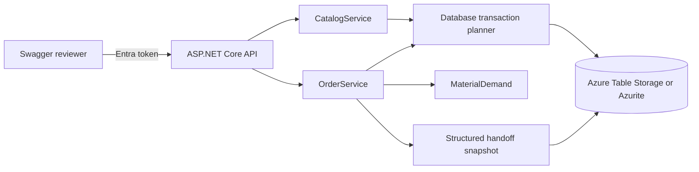

# SMT Order Management

An ASP.NET Core 8 API for Components, versioned Board recipes, stock reservations, Orders, and a production planning handoff. Swagger UI at `/swagger` is the reviewer interface. Azure Table Storage is the only persistent store; local development uses Azurite.

## Design



`Program` owns Entra authentication and HTTP routes. `CatalogService` owns Components and Board revisions. `OrderService` owns reservations and the production transition. `MaterialDemand` calculates demand without I/O. `Database` stores entities in one Table partition and commits changes as entity group transactions. Each mutation conditionally replaces one version entity using its ETag. If another API instance writes first, the request re-reads and recalculates before retrying. This protects stock and references across instances.

Components, Boards, revisions, Orders, unique part number indexes, and production snapshots occupy separate RowKey prefixes. Board recipes and Order lines are JSON properties; a production snapshot has structured header, Board, and Component entities. A Table Storage entity group transaction allows at most 100 entity operations in one partition. Order creation and edit check the eventual production batch size, and Board revisions are capped at 97 so deletion remains possible. Larger changes receive `batch_limit` or `revision_limit` before they leave unusable records. The shared partition and catalog scans suit this small reviewer demo; they limit throughput and dataset size.

Physical stock counts whole pieces. Available stock is physical stock minus reservations. Board edits append revisions and existing Orders retain their selected revision. Order create and edit aggregate `build quantity × recipe quantity` and reserve that demand atomically with stock changes. A Reserved Order can be edited or deleted. Its first download marks it Started, consumes physical stock, releases reservations, and saves the snapshot in one transaction. Later downloads read that snapshot, yielding the same JSON bytes. Started Orders cannot be edited or deleted.

## Local setup with Azurite

Requirements: Docker Compose and a Microsoft Entra tenant for reviewer sign in. Copy `.env.example` to `.env` and replace the placeholders. `.env` is Git ignored.

```sh
docker compose up --build -d
```

Compose runs the Azurite Table service on port 10002 and the API on port 8080. Open `http://localhost:8080/swagger`. `/health` is public; `/api` requires a delegated `access_as_user` token. The API creates its Table and version entity on startup.

To reset and seed the local demo, run:

```sh
docker compose run --rm api --reset-demo
```

Reset deletes all records, including started Orders and snapshots. The command prints the new Board and Reserved Order IDs. Run it only against a disposable demo Table. The seed has two used Components, one unassigned Component, one Controller Board, and one Reserved Order.

For tests outside Compose, start Azurite locally (`npx azurite-table --location ./azurite-data`) and run:

```sh
dotnet restore SmtOrders.sln
dotnet build SmtOrders.sln --no-restore
dotnet test SmtOrders.sln --no-build
```

The tests use `UseDevelopmentStorage=true` by default. Set `SMT_TEST_TABLES` to another Azurite connection string if needed. Each integration test creates and deletes its own uniquely named Table. CI runs the same suite against an Azurite service.

## Entra registration

1. Create a single tenant API app registration. Expose an Application ID URI such as `api://<api-client-id>` and the delegated scope `access_as_user`. Set `Entra__Audience` to the API token's `aud` value, `Entra__AppIdUri` to the URI, and `Entra__TenantId` to the tenant GUID.
2. Create a separate single tenant SPA registration. Add Swagger redirect URIs `http://localhost:8080/swagger/oauth2-redirect.html` and `https://<app-name>.azurewebsites.net/swagger/oauth2-redirect.html`. Give it delegated permission for the API scope and grant consent as your tenant requires. Set `Entra__BrowserClientId` to its client ID. Swagger uses authorization code with PKCE.
3. Use dedicated demo accounts for reviewers and share credentials privately. Authenticated users with the delegated scope have equal application permissions.

For another localhost port, register its redirect URI. See [Microsoft's JWT bearer guidance](https://learn.microsoft.com/en-us/aspnet/core/security/authentication/configure-jwt-bearer-authentication).

## API walkthrough

Authorize in Swagger and list `/api/components`, `/api/boards`, and `/api/orders`. Use the seeded Reserved Order ID returned by reset for `POST /api/orders/{id}/download`. Repeat the call to verify the same handoff bytes and a single stock deduction. Editing or deleting that started Order returns `order_started` (`409`). Search endpoints use `?q=text` against name or description, and empty results are `[]`.

Example requests:

```json
{"partNumber":"RES-47K","name":"47 kΩ resistor","description":"0603","physicalStock":250}
```

```json
{"partNumber":"SENSOR-BOARD","name":"Sensor board","description":"Prototype","lengthMm":80,"widthMm":50,"recipe":[{"componentId":"11111111-1111-1111-1111-111111111111","quantityPerBoard":2}]}
```

```json
{"name":"Pilot run","description":"Ten boards","orderDate":"2026-09-24","dueDate":null,"boards":[{"boardId":"aaaaaaaa-aaaa-aaaa-aaaa-aaaaaaaaaaaa","revision":1,"buildQuantity":10}]}
```

Use real IDs returned by the API for Board and Order requests. Invalid input returns `400`, missing records `404`, and conflicts `409`, each with `{ "code": "...", "message": "..." }`. Stock conflicts report the Component part number, required pieces, available pieces, and shortfall.

## Production protocol

The download media type is `application/vnd.smt-production.v1+json` and `schemaVersion` is `1.0`. It is a planning and kitting handoff for `SMT-LINE-1`. It contains Order dates and UTC start time, ordered Board lines with dimensions and build quantities, per Board Component requirements, and aggregate materials. `placementProgramId` is the Board ID plus revision. The actual placement program is managed outside this API; the JSON contains no placement coordinates.

## Live Azure demo

The shared reviewer API is deployed in West Europe at [smt-orders-e103ef-api.azurewebsites.net/swagger](https://smt-orders-e103ef-api.azurewebsites.net/swagger). Its resource group is `rg-smt-orders-demo` in subscription `85ed71b1-83f9-4a91-bf61-78fd20259323`. It uses Azure Table Storage and a managed identity. The Table is seeded with three Components, a Controller Board, and a Reserved Order. Sign in through Swagger using a tenant account allowed to consent to the delegated `access_as_user` scope; list `/api/orders` to find the current Order ID. The public `/health` endpoint returns `200`; an anonymous `/api/components` request returns `401`.

Verified on 2026-09-25: Entra sign-in, Component create/read/delete, Reserved Order creation, first production download, and an identical second download. The sample Board consumed three resistors on the first download: physical stock changed from 1,000 to 997 and remained there on retry. The original seeded Order remains Reserved for the walkthrough.

GitHub Actions [builds, tests, and deploys](https://github.com/Zergie/Coding-Challenge/actions/workflows/ci.yml) passing `main` commits. Deployment uses an Entra application with a federated credential for this repository's immutable GitHub identity and the `main` branch. It has Website Contributor access scoped to this Web App. Repository secrets hold the deployment client, tenant, and subscription IDs; no long lived credential is stored. The Swagger SPA's delegated permission is subject to the tenant's consent policy.

## Azure deployment setup

`infra/main.bicep` defines a Windows App Service F1 plan, a Standard LRS StorageV2 account, a Table, and a system assigned Web App identity with Storage Table Data Contributor on the storage account. The application uses `DefaultAzureCredential` and the Table service endpoint; no storage account key is placed in App Service settings. The region is West Europe (`westeurope`). The [retail estimate](docs/azure-cost-estimate.md) is about **$0.05/month** for 1 GB and 100,000 operations, below the $5/month soft target; check actual subscription pricing before provisioning.

To deploy, sign in to Azure CLI, select the subscription, create a resource group, and apply the template:

```powershell
$subscriptionId = 'YOUR_SUBSCRIPTION_ID'
$resourceGroup = 'YOUR_RESOURCE_GROUP'
$namePrefix = 'YOUR_GLOBALLY_UNIQUE_LOWERCASE_PREFIX'
$tenantId = 'YOUR_ENTRA_TENANT_ID'
$apiClientId = 'YOUR_API_CLIENT_ID'
$browserClientId = 'YOUR_BROWSER_CLIENT_ID'
az account set --subscription $subscriptionId
az group create --name $resourceGroup --location westeurope
az deployment group create --resource-group $resourceGroup --template-file infra/main.bicep --parameters namePrefix=$namePrefix tenantId=$tenantId apiAudience=$apiClientId appIdUri="api://$apiClientId" browserClientId=$browserClientId
```

Allow time for role assignment propagation before the app first accesses Table Storage. Verify `/health`, anonymous `401`, Entra sign in, and the create-to-download path. The GitHub workflow deploys on a passing `main` push when `vars.AZURE_WEBAPP_NAME` is set; configure OIDC secrets and a federated credential before using it. [Azure's App Service deployment guide](https://learn.microsoft.com/en-us/azure/app-service/deploy-github-actions) covers that setup. Remove the resource group when review ends to stop storage charges.

## Limits

The one-partition version record serializes writes and raises contention under load. Table scans and JSON properties are appropriate for this small shared demo, not a large catalog. App Service Free can sleep or exhaust its quota. Production completion, scrap, replenishment, and line management are outside this API.
