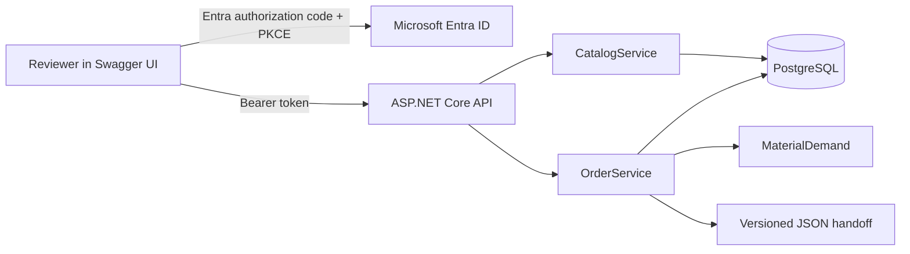

# SMT Order Management

An authenticated ASP.NET Core 8 API for Components, versioned Board recipes, stock reservations, Orders, and a deterministic production planning handoff. Swagger UI at `/swagger` is the reviewer interface. PostgreSQL is the only data store.

## Architecture



`Program` owns authentication, HTTP routes, and error mapping. `CatalogService` owns Component and Board validation and persistence. `OrderService` owns reservation and production transitions. `MaterialDemand` is a pure calculation. `Database` opens connections and serializes writes with a PostgreSQL transaction advisory lock. The lock applies across API instances. This is intentionally simple for a low traffic demo; a larger service would use narrower row locking and database migrations.

### Invariants

- Component physical stock is whole pieces on hand. Available stock = physical stock − active reservations. A Component may exist without Board usage.
- Every Board revision has a nonempty recipe with positive per Board quantities. A Board edit appends a revision. Existing Orders retain their selected revision.
- An Order has at least one Board line and positive build quantities. Demand is the sum of `build quantity × recipe quantity` by Component. Creation and edit compare that demand to stock within the same transaction as reservation changes.
- A Reserved Order may be edited or deleted. The first download changes it to Started, decreases physical stock, releases the reservation, and saves structured snapshot rows. Started Orders cannot be edited or deleted.
- Retry downloads read only the snapshot. They use fixed field and list ordering, one recorded UTC start time, and no live stock values or per request timestamp, so JSON bytes are identical.

## Local setup

Requirements: Docker with Compose, and a Microsoft Entra tenant for reviewer sign in. Copy `.env.example` to `.env` and replace every placeholder. `.env` is ignored by Git. Start the API and PostgreSQL:

```sh
docker compose up --build -d
```

Open `http://localhost:8080/swagger`. The API applies its initial schema at startup. `/health` is public; all `/api` routes require a delegated token with `access_as_user` scope. To seed or restore the shared demo after the API has started:

```sh
docker compose exec -T db psql -U smt -d smt -f /dev/stdin < demo/reset.sql
```

In PowerShell, use `Get-Content -Raw demo/reset.sql | docker compose exec -T db psql -U smt -d smt -f /dev/stdin`. Reset discards all demo records, including started Orders and snapshots. Do not run it against production data.

To run the tests locally, start the database, then set `SMT_TEST_POSTGRES` to a connection string for the separate `smt_test` database. Compose creates that database on first initialization. Run:

```sh
dotnet restore SmtOrders.sln
dotnet build SmtOrders.sln --no-restore
dotnet test SmtOrders.sln --no-build
```

The integration tests clear `smt_test`. CI runs the same commands with a PostgreSQL service. Do not point them at the demo database.

## Entra registration

1. Create a **single tenant** API app registration. Expose an Application ID URI such as `api://<api-client-id>` and delegated scope `access_as_user`. Set `Entra__Audience` to the API token's `aud` value (normally the API client ID), `Entra__AppIdUri` to that URI, and `Entra__TenantId` to the tenant GUID.
2. Create a separate single tenant **SPA** registration. Add redirect URIs `http://localhost:8080/swagger/oauth2-redirect.html` and `https://<app-name>.azurewebsites.net/swagger/oauth2-redirect.html`. Give it delegated permission for the API scope and grant consent as required by the tenant. Set `Entra__BrowserClientId` to this registration's client ID. Swagger uses authorization code with PKCE.
3. Create dedicated demo user accounts in the tenant and give their credentials to reviewers privately. All authenticated users with the delegated scope have equal application permissions. Never commit their credentials or tokens.

For another localhost port, register its matching redirect URI. In Azure, set the same configuration as App Service application settings. [Microsoft's JWT bearer guidance](https://learn.microsoft.com/en-us/aspnet/core/security/authentication/configure-jwt-bearer-authentication) explains audience and issuer validation.

## API walkthrough

Authorize in Swagger, then:

1. `GET /api/components` shows physical, reserved, and available stock. The seed has two used Components and one unassigned Component.
2. `GET /api/boards` shows the current Controller board revision. `GET /api/boards/{id}/revisions/1` retrieves a fixed recipe.
3. `GET /api/orders` shows a Reserved demo Order. Its ID is `bbbbbbbb-bbbb-bbbb-bbbb-bbbbbbbbbbbb` after reset.
4. `POST /api/orders/{id}/download` starts production and returns the JSON handoff. Repeat the call and compare the bytes. The stock deduction occurs once.
5. Try editing or deleting the started Order and observe the `order_started` conflict.

Search endpoints use `?q=text` against name or description; an empty result is `[]`. Create, read, edit, search, and delete are single record operations. Board edits create a new revision. Order edits must name the desired revision explicitly.

Example Component request:

```json
{"partNumber":"RES-47K","name":"47 kΩ resistor","description":"0603","physicalStock":250}
```

Example Board request, using a real Component ID:

```json
{"partNumber":"SENSOR-BOARD","name":"Sensor board","description":"Prototype","lengthMm":80,"widthMm":50,"recipe":[{"componentId":"11111111-1111-1111-1111-111111111111","quantityPerBoard":2}]}
```

Example Order request, using the seed Board ID:

```json
{"name":"Pilot run","description":"Ten boards","orderDate":"2026-09-24","dueDate":null,"boards":[{"boardId":"aaaaaaaa-aaaa-aaaa-aaaa-aaaaaaaaaaaa","revision":1,"buildQuantity":10}]}
```

Invalid inputs return `400`, missing records `404`, and conflicts `409` with `{ "code": "...", "message": "..." }`. Stock conflicts report the Component part number, required pieces, available pieces, and shortfall.

## Production protocol

The download media type is `application/vnd.smt-production.v1+json`; `schemaVersion` is `1.0`. It is a custom planning and kitting handoff for one configured destination, `SMT-LINE-1`. It includes Order identification and dates, UTC start time, ordered Board lines, each Board's ID, part number, revision, dimensions and build quantity, per Board Component requirements, and aggregate materials. `placementProgramId` is the Board ID plus revision; the actual placement program is managed outside this API. The protocol contains no placement coordinates and makes no IPC-CFX claim.

## Azure demo deployment

`infra/main.bicep` defines a Windows App Service Free plan, the API, and PostgreSQL Flexible Server with 32 GiB storage and a small Burstable SKU. The database uses public access with the Azure services firewall rule because App Service Free has no private network integration. Keep the demo short lived and use a strong database password. [Azure documents this firewall rule](https://learn.microsoft.com/en-us/azure/postgresql/network/how-to-networking-servers-deployed-public-access-add-firewall-rules) as permitting connections from all Azure services.

**Cost gate:** The requested region is **West Europe** (`westeurope`). The [retail estimate](docs/azure-cost-estimate.md), checked 2026-09-25, is approximately **$18.91/month** for PostgreSQL B1ms compute and 32 GB storage, or **$4.35 for 168 hours**. This exceeds the soft **$5/month** target. App Service Free has quotas and cold starts. Subscription credits, taxes, and excess backup are not included; verify the subscription's actual billing terms before provisioning. No resource is provisioned by this repository alone.

After that gate, sign in with Azure CLI, select the subscription, create a resource group, and deploy with a secure password parameter from your local environment or secret store:

```sh
az account set --subscription <subscription-id>
az group create --name <resource-group> --location westeurope
az deployment group create --resource-group <resource-group> --template-file infra/main.bicep --parameters namePrefix=<unique-prefix> postgresPassword=<secure-value> tenantId=<tenant-guid> apiAudience=<api-client-id> appIdUri=api://<api-client-id> browserClientId=<browser-client-id>
```

Avoid typing a real password into shell history: use an `az deployment group create` parameters file outside this repository or a secure interactive parameter workflow. The template stores the connection string in App Service settings; no secret belongs in source control. Verify `/health`, anonymous `401`, Entra sign in, and the seeded create-to-download path after deployment. Add `vars.AZURE_WEBAPP_NAME` and GitHub secrets `AZURE_CLIENT_ID`, `AZURE_TENANT_ID`, `AZURE_SUBSCRIPTION_ID`; configure a federated credential for `repo:<owner>/<repo>:ref:refs/heads/main` with a role allowed to deploy the Web App. The workflow deploys only after build and tests pass on `main`. [Azure's App Service deployment guide](https://learn.microsoft.com/en-us/azure/app-service/deploy-github-actions) covers OIDC setup.

For a cloud reset, run `demo/reset.sql` through an administrator connection after the API has applied schema. Review PostgreSQL firewall access for your administrator IP first. Remove the resource group when the review ends to stop billing.

## Tradeoffs and limits

The global transaction lock favors correctness and simple reasoning over throughput. Schema creation is repeatable for a fresh demo but is not an upgrade migration system. The shared demo means one reviewer can change records another sees; reset restores the baseline. App Service Free may sleep or exhaust its daily quota. The JSON protocol is a snapshot of planning values, not an executable placement program. Production completion, scrap, replenishment, and line management are outside scope.
